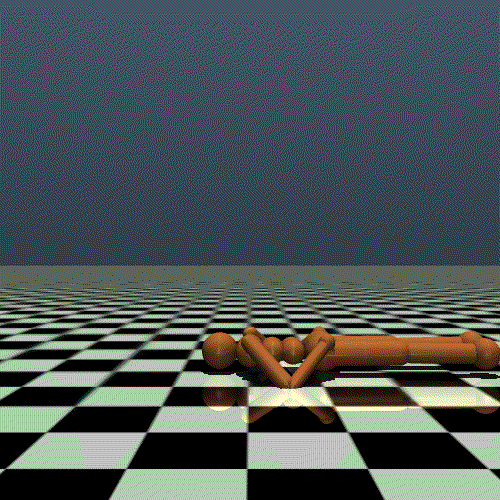
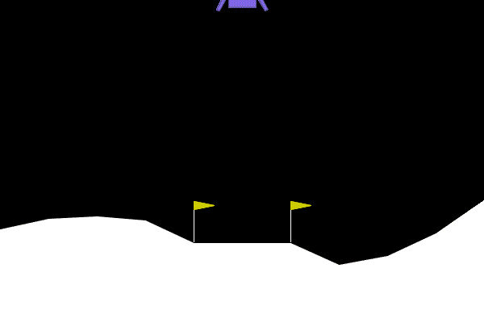
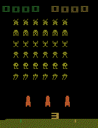
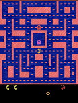

# Reinforcement Learning Basic Exercise
This repository sharing my practice on Reinforcement Learning (RL) in the OpanAI Gym  http://gym.openai.com by different RL methods.

### Environments provided in OpenAI:
1. Atari
2. Box2D
3. Classic Control
4. MuJoCo
5. Robotics

### Logs:
2022-04-25 Uploaded ***Class Control - CartPole-v1 220424.ipynb***

***Executive Summary:***

In this notebook, a pole is attached by an un-actuated joint to a cart, which moves along a frictionless track and ***the goal is to prevent it from falling over.*** I try differnet methods to complete this goal. First, ***a simle policy to choose actions by monitoring the Velocity of Pole Angular***, but the ***average score only reach 181 out of 500***. Second, the ***agent with deep learning nerual network with Keras*** received 500 out of 500 scores starting from 36220 episode***. Third, the ***agent with Epsilon-Greedy Policy reach perfect score at epoch #31*** during the learning process in only 6 minutes of learning. Forth, the ***agent with Deep Crossentropy Method (Monte Carlo Method)*** with ***mean reward reach 499 at around 25 sessions***. Finally, the ***Actor Critic Network with 2 fully conneted layers***, it reach ***highest performance in episode 8437 with score 364*** and ***avgerage score 335.9***. (Time spend 9h 45min)

----------------------------------------------------------------------------------------------------------

2022-04-04 Uploaded ***Robotics - FetchReach-v1 - 220404.ipynb***

***Executive Summary:***

In this notebook, ***A goal position is randomly chosen in 3D space. Control Fetch's end effector to reach that goal as quickly as possible***. First, I started with taken random actions ***The fetch fail to pick up anything at all***, at the end of each episode score receive -50 all the time. After that, I used ***stable_baselines3 PPO model to traing the Agent*** to train an agent in order to complete this goal. As a result, ***Agent best performance during the learning at 1.1 million timesteps***, the ***average reward received -4.4*** (time spend: 36min 42second), ***the agent perform significantly better and the fetch directly reach the red ball immediatly all the time***.

----------------------------------------------------------------------------------------------------------

2022-04-01 Uploaded ***MuJoCo - HumanoidStandup-v2 PPO 220401.ipynb***

***Executive Summary:***

In this notebook, ***the goal of the environment is to make the humanoid standup*** and ***then keep it standing by applying torques on the various hinges***. First, I started with taken random actions ***The body of robot keep on the ground all the time and only both legs are moving around but fail to standup***, at the end of each episode score receive between 32648 to 33854 (average 33418). After that, I used ***stable_baselines3 PPO model to traing the Agent*** to train an agent in order to complete this goal. As a result, ***Agent best performance during the learning at 2.6 million timesteps***, the ***average reward received 148623*** (time spend: 50min), that is almost 5 times better performance than taken random actions.

----------------------------------------------------------------------------------------------------------

2022-03-28 Uploaded ***MuJoCo - Humanoid-v2 220329.ipynb***

***Executive Summary:***

In this notebook, ***The goal is make a three-dimensional bipedal robot walk forward as fast as possible, without falling over***. First, I started with taken random action only and recorded score between 83 to 145 (average 112), that means ***the robot falling over very quickly***. After that, I used ***Epsilon-Greedy Policy*** to train an agent in order to complete this goal. As a result, ***Agent with Epsilon-Greedy Policy stop learning process at epoch #201 with average reward 1014*** (time spend: 40min)

***Important Note: install mujoco_py version 2.0.2.8*** instead of latest version

----------------------------------------------------------------------------------------------------------

2022-03-23 Uploaded ***Box2D - LunarLander-v2 220323.ipynb***

***Executive Summary:***

In this notebook, the environment is a classic rocket trajectory optimization problem. ***The goal is to land the lunar lander moving from the top of the screen to the landing pad.*** I try differnet methods to complete this goal. First, I create a ***Deep Learning Model with Keras***, after 1 milliom timesteps of learning (Time spend: 1hr 25min), the agent received ***score between -10 to 277 (average 218.0). The Lunar Lander landing on the ground 4 out of 5 times properly.*** Second, I use the agent with ***Epsilon-Greedy Policy***, it stop learning at epoch #85 with ***average reward 302*** (time spend: 1hr 19min). Finally, I use ***PPO Model in Stable_baseline3***, the ***average reward rise to above 160 consistently after 2.25M learning timesteps*** and the average length of episode after 2.25M learning timesteps is around 350. (time spend: 1h 34min)

----------------------------------------------------------------------------------------------------------

2022-03-19 Uploaded ***Class Control - MountainCar-v0 added Epsilon-Greedy Policy.ipynb***

***Executive Summary:***

I added 2 sections in the last Class Control - MountainCar-v0 notebook. The Agent with ***Epsilon-Greedy Policy did not learn well in 100 epoch***, and then I revised the network remain with 4 layers but ***decrease trainable params to 8,835*** and ***increase number of epoch to 500***, set the learning procress stop when ***the mean of session rewards > -85*** (which is the performance of the second agent in section 5.3 last notebook. The ***learning process stop at epoch #274 (time spend: 1hr 48min)*** and the car reaches the flag on the right.

2022-03-17 Uploaded ***Class Control - MountainCar-v0.ipynb***

***Executive Summary:***

In this notebook, a car is on a one-dimensional track, positioned between two "mountains". ***The goal is to drive up the mountain reaches the flag on the right***. I try differnet methods to complete this goal, by comparing the retrained agent with more training steps (total 500k) and larger learning rate (1e-3), the car reaches the flag on the right with ***20% timesteps saving than the simple policy*** without any learning and ***32% timesteps saving than the agent with less training timesteps (total 200k) and smaller learning rate (1e-4)***.

----------------------------------------------------------------------------------------------------------

2022-03-14 Uploaded ***Atari - SpaceInvaders-v0.ipynb***

***Executive Summary:***

I tried to ***build a deep learning model with Tensorflow for reinforcement learning*** and ***training a live reinforcement learning model using Keras-RL***. By comparing the agent's performance different between training for 100k timesteps and 1 million timesteps. The result show that ***the Agent's performance after training for 1 million timesteps perfrom 42.7% better in terms of average scores received***, and ***time spend more than 21 hours to train for 34,852,326 trainable params in 100k timesteps by CPU***.

----------------------------------------------------------------------------------------------------------

2022-03-13 Uploaded ***Atari - MsPacman-v0-3M_timesteps.ipynb***

***Executive Summary:***

I tried to ***compare the agaent's performance different between training for 1 million and 3 million timesteps*** by using exactly the same parameters except number of timesteps to train both agents. The result show that ***the Agent's performance after training for 3 million timesteps perfrom 55% better in terms of scores received***, but the ***time spending for training by CUP are 3 times more*** compare to the Agent's performance after training only for 1 million timesteps.  

Hope you enjoy it! Please share with me if you have even better solution or some other interesting environment for practicing RL purpose.
